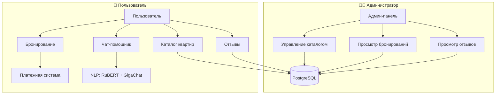

# 🏠 RentalsApartment_bot  

**Интеллектуальный Telegram-бот для аренды квартир**. Проект реализует полный цикл работы с объектами недвижимости от структурированного ввода и хранения данных до поиска, бронирования и интеллектуального ответа на вопросы пользователей.

## 🚀 Возможности

### 👨‍💻 **Администратору**
- 📤 Ввод структурированных характеристик (фото, описание, площадь, адрес, цена, категория)
- ✏️ Редактирование/удаление записей
- 📊 Просмотр заявок и отзывов
- 🤖 Автоматическая классификация отзывов с помощью NLP-модели RuBERT, которая определяет тональность и категории комментариев

### 👤 **Пользователю**
- 🏡 Каталог с пагинацией ("◀ Пред.", "След. ▶")
- 💳 Оплата через Telegram (PayMaster)
- 🧠 Нейропомощник: отвечает на вопросы пользователей с помощью локальной LLM через платформу Ollama.
- 📞 Контакты компании (сайт/телефон)
- 🌙 Круглосуточное бронирование с проверкой конфликтов дат
---
## 🏗️ Архитектура

Проект построен вокруг разделения ролей **администратора** и **пользователя**, с централизованным хранилищем данных и отдельными компонентами для управления каталогом, бронирований и автоматической классификации отзывов пользователей:

## Локальная vs облачная LLM для диалогового ассистента

| Критерий          | **☁ Облачная LLM** | **🖥 Локальная LLM** | **Как это влияет на проект** |
|-------------------------------|------------------------|-------------------|----------------|
| **Приватность данных 🛡**            |Диалоги и запросы пользователей отправляются внешнему сервису| Всё остаётся на сервере бота | Бронирования и вопросы пользователей не покидают инфраструктуру проекта |
| **Стоимость эксплуатации 💸** |Оплата за каждый токен/запрос | Разовая настройка и использование своих ресурсов | Масштабирование количества пользователей не увеличивает расходы на AI |
| **Доступность 🌐** |Зависимость от интернета и API | Автономная работа на сервере | Круглосуточная работа чат-помощника без риска недоступности внешнего сервиса|
| **Настройка производительности ⚡** |Зависит от провайдера | Можно оптимизировать локально под конкретные ресурсы | Подстраивание под доступную RAM, CPU/GPU, ускорение откликов |

## 🧪 Тестирование работы бота

### Протестируйте ИИ-помощника на разных промптах
| Тип запроса | Пример | Ожидаемый ответ |
|-------------|--------|-----------------|
| **Не по теме** | "Как приготовить пасту?" | "Извините, я могу помогать только с вопросами по аренде жилья." |
| **Юридический** | "Можно ли расторгнуть договор?" | "По юридическим вопросам рекомендую обратиться к специалисту." |
| **Каталог** | "Какие квартиры есть?" | Ответ содержит "🛍Каталог" и предложение посмотреть варианты |
| **Уточняющий** | "Хочу снять квартиру" | Может задать уточняющие вопросы: "Какой тип жилья?", "На какой срок?" |

### Аналитика отзывов с RuBERT

Бот использует модель RuBERT для анализа пользовательских отзывов  
и автоматической классификации их по тональности.

| Категория | Пример отзыва | Классификация |
|------------|---------------|----------------|
| **Позитивный** | «Отличная квартира, всё чисто и удобно!» | 😊 Positive |
| **Нейтральный** | «Жильё соответствует описанию.» | 😐 Neutral |
| **Негативный** | «Слишком шумно по ночам.» | 😠 Negative |

### Тестирование платежей
Используйте тестовые карты:
- **PayMaster**: `4100 0000 0000 0001` <br />
Срок действия: 03/26<br />
CVC/CVV: 111<br />

### Проверка админ-панели
1. Добавьте новую квартиру через "➕Добавить данные"
2. Проверьте редактирование через "✏️Редактировать каталог"
3. Убедитесь, что бронирования появляются в "📜Список бронирований"
## 📸 Скриншоты

### Админ-панель
<br />
<br />
<br />
<br />
<br />
<br />
<br />

### Пользовательский интерфейс
<br />
<br />
<br />
<br />
<br />

## 💳 Платежные системы
### PayMaster
<br />
*Преимущество: мгновенное подтверждение брони*

---
## 📂 Структура проекта

```text
RentalsApartment_bot/
├── migrations/ 
├── src/                          # Основной код приложения
│   ├── db/                       # Работа с базой данных
│   │   ├── __init__.py
│   │   ├── crud.py
│   │   ├── database.py
│   │   └── models.py
│   ├── keyboards/                # Клавиатуры для пользователей и админов
│   │   ├── __init__.py
│   │   ├── admin_keyboard.py
│   │   └── user_keyboard.py
│   ├── nlp/                      # NLP и обработка текстов
│   │   ├── __init__.py
│   │   ├── llm_client.py
│   │   └── sentiment_analyzer.py
├── handlers/                     # Хендлеры бота
│   ├── __init__.py
│   ├── admin_panel/              # Админские хендлеры
│   │   ├── __init__.py
│   │   ├── add_apartment_handlers.py
│   │   ├── edit_apartment_handlers.py
│   │   ├── catalog_handlers.py
│   │   ├── reviews_handlers.py
│   │   └── bookings_handlers.py
│   └── user_handlers.py          # Хендлеры для обычных пользователей
├── utils/                        # Утилиты
│   └── catalog_utils.py
├── payment.py                     # Логика платежей
├── states.py                      # Состояния FSM
├── main.py                        # Точка входа бота
├── Dockerfile                     # Контейнеризация
├── docker-compose.yml             # Сборка и запуск контейнеров
├── .env                           # Переменные окружения
└── alembic.ini
```
## 🛠️ Технологии

| Модуль          | Описание                          |
|-----------------|-----------------------------------|
| `aiogram`       | Фреймворк для создания Telegram-ботов|
| `psycopg-binary`|Предкомпилированный клиент PostgreSQL для быстрого развертывания бота|
| `SQLAlchemy`| Работа с PostgreSQL через ORM и выполнение SQL-запросов|
| `pgvector`|Расширение PostgreSQL для хранения и поиска по векторным данным (эмбеддингам)|
| `alembic`|Инструмент для управления миграциями базы данных и автоматического обновления схемы PostgreSQL|
| `python-dotenv` | Работа с переменными окружения|
| `transformers` | Библиотека для NLP и работы с трансформерами от Hugging Face|
| `sentence-transformers`|Библиотека для генерации векторных представлений текста (эмбеддингов) на основе трансформер-моделей|
| `torch` |Фреймворк PyTorch для запуска и обработки готовых нейросетевых моделей|
| `ollama`|Локальный клиент для работы с GPT-моделями через Ollama|
| **NLP-модель**  | [blanchefort/rubert-base-cased-sentiment](https://huggingface.co/blanchefort/rubert-base-cased-sentiment) |

---
## 📦 Установка

## Инструкция по использованию бота:<br />

Для успешного запуска и использования бота, выполните следующие шаги:

### Шаг 1: Заполнение файла ".env"
Файл ".env" содержит все важные параметры конфигурации, которые необходимы для работы бота. Убедитесь, что вы заполнили все требуемые поля:

- **TOKEN**: Токен вашего бота, который можно получить, обратившись к [@BotFather](https://t.me/BotFather).
- **ADMIN_ID**: Ваш личный ID в Telegram. Получить его можно с помощью бота [@TheGetAnyID_bot](https://t.me/TheGetAnyID_bot).
- **PAYMENTS_TOKEN**: Токен для обработки платежей. Также можно получить у [@BotFather](https://t.me/BotFather).

### Пример заполнения файла .env:
```plaintext
TOKEN=ВАШ_ТОКЕН
ADMIN_ID=ВАШ_ADMIN_ID
PAYMENTS_TOKEN=ВАШ_PAYMENT_TOKEN
```
### Шаг 2: Подключение к базе данных на PostgreSQL
Для работы с базой данных требуется указать параметры подключения в файле ".env":

- **HOST**: Адрес хоста базы данных.
- **DBNAME**: Имя базы данных.
- **USER**: Имя пользователя для доступа к базе данных.
- **PASSWORD**: Пароль к базе данных.
- **PORT**: Порт для подключения (например, 5432 по умолчанию для PostgreSQL).

### Пример заполнения:
```plaintext
HOST="host.docker.internal"
DBNAME="example_db"
USER="admin_user"
PASSWORD="strongpassword"
PORT="5432"
```

### Шаг 3: Подготовка виртуального окружения и запуск бота

1. Создайте виртуальное окружение для изоляции зависимостей проекта. 
   Используйте команду:
   ```bash
   python -m venv venv
   ```

2. Активируйте виртуальное окружение:
   - На Windows:
     ```bash
     venv\Scripts\activate
     ```
   - На macOS и Linux:
     ```bash
     source venv/bin/activate
     ```
3. Установка зависимостей:
      ```bash
      pip install -r requirements.txt
      ```
4. Запуск Ollama (скачивается образ, если нет):
   ```bash
    docker-compose up -d ollama
     ```
5. Загрузка нужной модели внутрь Ollama:
   ```bash
    docker exec -it ollama /bin/ollama pull infidelis/GigaChat-20B-A3B-instruct:q4_0
     ```
6. Проверка, что модель есть:
   ```bash
   docker exec -it ollama /bin/ollama list
     ```
7. Сборка образа в Docker:
   ```bash
    docker-compose up -d --build
     ```
8. Запуск контейнера:
   ```bash
   docker-compose up
   ```
9. Создание новой миграции:
   ```bash
   docker compose exec bot alembic revision --autogenerate
   ```
10. Применение миграций к базе данных:
   ```bash
   docker compose exec bot alembic upgrade head
   ```

Теперь бот должен быть готов к использованию. Убедитесь, что ваше соединение с интернетом активно и все конфигурации настроены корректно. Если возникнут ошибки, проверьте файл ".env" на наличие опечаток или некорректных значений.
