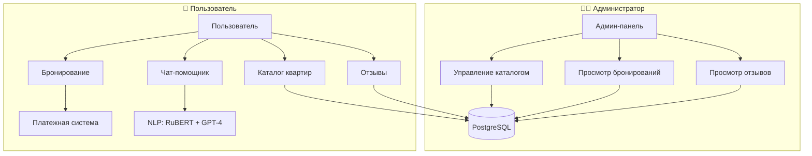

# 🏠 RentalsApartment_bot  

**Telegram-бот для автоматизации аренды квартир** с админ-панелью, интеграцией платежных систем и аналитикой отзывов.    
## 🚀 Возможности

### 👨‍💻 **Администратору**
- 📤 Добавление квартир (фото + описание)
- ✏️ Редактирование/удаление записей
- 📊 Просмотр заявок и отзывов
- 🤖 **Автоматическая классификация отзывов** (NLP-модель)
### 👤 **Пользователю**
- 🏡 Каталог с пагинацией ("◀ Пред.", "След. ▶")
- 💳 Оплата через Telegram (PayMaster)
- 📞 Контакты компании (сайт/телефон)
- 🌙 Круглосуточное бронирование
---
## 🌐 Архитектура

## 🧪 Тестирование работы бота

### Проверка GPT-ассистента
Протестируйте ИИ-помощник с разными типами запросов:

| Тип запроса | Пример | Ожидаемый ответ |
|-------------|--------|-----------------|
| **Не по теме** | "Как приготовить пасту?" | "Извините, я могу помогать только с вопросами по аренде жилья." |
| **Юридический** | "Можно ли расторгнуть договор?" | "По юридическим вопросам рекомендую обратиться к специалисту." |
| **Каталог** | "Какие квартиры есть?" | Ответ содержит "🛍Каталог" и предложение посмотреть варианты |
| **Уточняющий** | "Хочу снять квартиру" | Может задать уточняющие вопросы: "Какой тип жилья?", "На какой срок?" |

### Тестирование платежей
Используйте тестовые карты:
- **PayMaster**: `4100 0000 0000 0001` <br />
Срок действия: 03/26<br />
CVC/CVV: 111<br />

### Проверка админ-панели
1. Добавьте новую квартиру через "➕Добавить данные"
2. Проверьте редактирование через "✏️Редактировать каталог"
3. Убедитесь, что бронирования появляются в "📜Список бронирований"
## 📸 Скриншоты

### Админ-панель
<br />
<br />
<br />
<br />
<br />
<br />
<br />

### Пользовательский интерфейс
<br />
<br />
<br />
<br />
<br />

## 💳 Платежные системы
### PayMaster
<br />
*Преимущество: мгновенное подтверждение брони*

---

## 🛠️ Технологии

| Модуль          | Описание                          |
|-----------------|-----------------------------------|
| `aiogram`       | Фреймворк для создания Telegram-ботов|
| `psycopg2-binary`|Предкомпилированный клиент PostgreSQL для быстрого развертывания бота|
| `aiohttp`      |Асинхронные HTTP-запросы и веб-сервер|
| `python-dotenv` | Работа с переменными окружения|
| `transformers` | Библиотека для NLP и работы с трансформерами от Hugging Face|
| `torch` |Фреймворк глубокого обучения PyTorch|
| `evaluate` |Библиотека для оценки моделей машинного обучения|
| `g4f`           | Бесплатный аналог ChatGPT         |
| **NLP-модель**  | [blanchefort/rubert-base-cased-sentiment](https://huggingface.co/blanchefort/rubert-base-cased-sentiment) |

---
## 🚧 Дорожная карта

- ✅ **Реализовано**:  
  - Базовый функционал бронирования
  - Каскадного удаления  
  - Интеграция с PayMaster и Сбербанком  
🔄 **В разработке**:
- Чат с ИИ-ассистентом *(базовая интеграция GPT для ответов на вопросы)*    
*Дорожная карта будет обновляться по мере добавления новых функций*  
---

## 🛠 Установка

## Инструкция по использованию бота:<br />

Для успешного запуска и использования бота, выполните следующие шаги:

### Шаг 1: Заполнение файла ".env"
Файл ".env" содержит все важные параметры конфигурации, которые необходимы для работы бота. Убедитесь, что вы заполнили все требуемые поля:

- **TOKEN**: Токен вашего бота, который можно получить, обратившись к [@BotFather](https://t.me/BotFather).
- **ADMIN_ID**: Ваш личный ID в Telegram. Получить его можно с помощью бота [@getmyid_bot](https://t.me/getmyid_bot).
- **PAYMENTS_TOKEN**: Токен для обработки платежей. Также можно получить у [@BotFather](https://t.me/BotFather).

### Пример заполнения файла .env:
```plaintext
TOKEN=ВАШ_ТОКЕН
ADMIN_ID=ВАШ_ADMIN_ID
PAYMENTS_TOKEN=ВАШ_PAYMENT_TOKEN
```
### Шаг 2: Подключение к базе данных на PostgreSQL
Для работы с базой данных требуется указать параметры подключения в файле ".env":

- **HOST**: Адрес хоста базы данных.
- **DBNAME**: Имя базы данных.
- **USER**: Имя пользователя для доступа к базе данных.
- **PASSWORD**: Пароль к базе данных.
- **PORT**: Порт для подключения (например, 5432 по умолчанию для PostgreSQL).

### Пример заполнения:
```plaintext
HOST="host.docker.internal"
DBNAME="example_db"
USER="admin_user"
PASSWORD="strongpassword"
PORT="5432"
```

### Шаг 3: Подготовка виртуального окружения и запуск бота

1. Создайте виртуальное окружение для изоляции зависимостей проекта. 
   Используйте команду:
   ```bash
   python -m venv venv
   ```

2. Активируйте виртуальное окружение:
   - На Windows:
     ```bash
     venv\Scripts\activate
     ```
   - На macOS и Linux:
     ```bash
     source venv/bin/activate
     ```
3. Сборка образа в Docker с очисткой кэша:
   ```bash
     docker-compose build --no-cache
     ```
4. Запуск контейнера:
   ```bash
   docker-compose up
   ```

Теперь бот должен быть готов к использованию. Убедитесь, что ваше соединение с интернетом активно и все конфигурации настроены корректно. Если возникнут ошибки, проверьте файл ".env" на наличие опечаток или некорректных значений.
